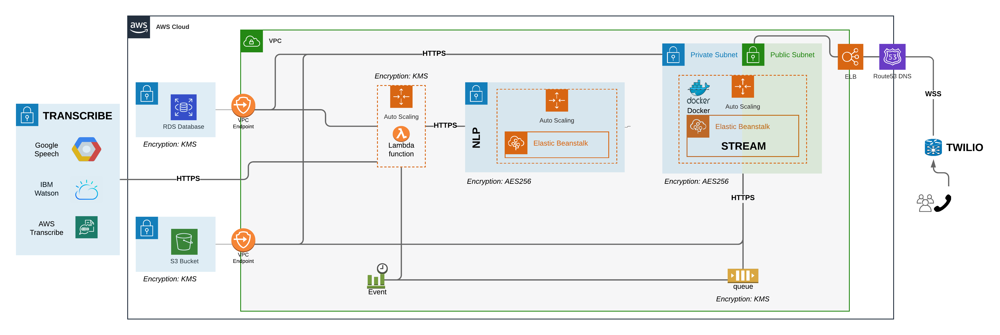

# AsTeR

`Authors: Thomas Galeon, Meryll Dindin`

AsTeR is an opensource platform for collecting, analyzing and prioritizing information during natural disasters. We help first responders make the most of limited resources so they can save as many lives as possible.

AsTeR collects information during natural disasters and makes it readily available for emergency centers. AsTeR develops a variety of services to analyze various types of data, from emergency calls to satellite images and social media. Each service constitutes its own repo within the [Project AsTeR organisation](https://github.com/Project-AsTeR). This [aster repositiory](https://github.com/Project-AsTeR/aster/) combines all of AsTeR's services into a single platform which can be used by first responders during natural disasters.

## Getting started

Each service used by the general platform is dismantled into containerized services. For accessibility purposes, each of those projects has been developed in a different Git repository under the general **Project AsTeR** organization. Here is an overview of the current stage of the project:

* [**website**](https://github.com/Project-AsTeR/website): Host the current web platform (Flask, HTML, CSS and JS), presenting the project as well as the roadmap for the vision. The website also host a working demo of our core product, but is kept independent from the general software platform.
* [**stream**](https://github.com/Project-AsTeR/stream): Core Docker container absorbing the incoming stream of emergency calls from a Twilio endpoint, over a secured websocket. Concurrent threads are also hosted on this service, to retrieve call specific meta-data, converting audio-files from ULAW to WAV, and running real-time transcription with the GCP endpoint.
* [**trigger**](https://github.com/Project-AsTeR/trigger): Build the lambda function triggered by SQS events everytime a new call is streamed to our platform. It aims at doing the transcriptions (IBM, GCP and AWS as providers so far) and the analysis (by calling our NLP endpoint).
* [**scoring**](https://github.com/Project-AsTeR/scoring): Core service aimed at attributing priority to an incoming transcript. It also uses NLU for emotion analysis, and keywords extraction.
* [**bastion**](https://github.com/Project-AsTeR/bastion): With such an explicit name, this service is a back-up instance aimed at being poped-up to proxy with the internal services of our VPC, in order to avoid to be locked out due to security issues.

### Prerequisites

*In construction ...*

### Installing AsTeR

*In construction ...*

### Trying out AsTeR

*In construction ...*

## Contribution guidelines

__*If you want to contribute to AsTeR, please review the [contribution guidelines](CONTRIBUTING.md) as well as our [code of conduct](CODE_OF_CONDUCT).*__

## Licence

This project is licensed under the Apache 2.0 License - see the [LICENSE](LICENSE) file for details.
